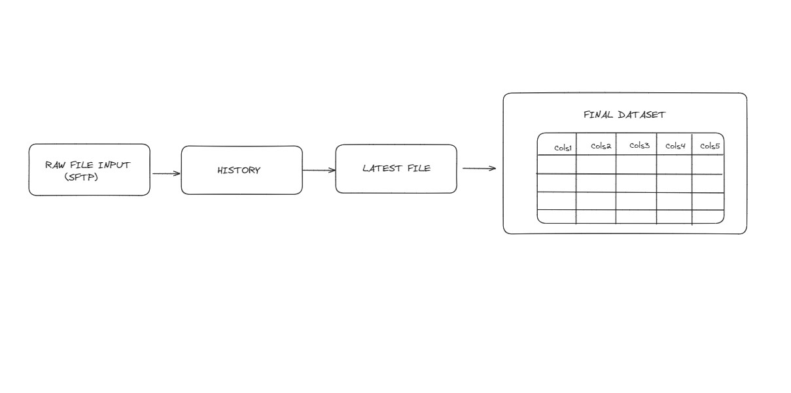

# Historicizing  files transfered by SFTP
## Task: 
##### Create dataset from the incoming files from a SFTP server. A file will be ingested daily at 4am UTC in csv format. File overwrites daily so we also need to keep history of the files in case we need to reference back to them.

## Steps to take:

- **Creating code that keeps history of the tables**: [Click here to see the code!](https://github.com/Kovaczso/Python/blob/main/Pyspark/Keeping%20history%20of%20Input%20files/History.py)
- **Choosing the latest file from the history**: [Click here to see the code!](https://github.com/Kovaczso/Python/blob/main/Pyspark/Keeping%20history%20of%20Input%20files/Latest_file.py)
- **Creating dataset from the latest file**: [Click here to see the code!](https://github.com/Kovaczso/Python/blob/main/Pyspark/Keeping%20history%20of%20Input%20files/Final_dataset.py)

#### **Note:** Codes are written and used on Palantir-Foundry

# 

- **Schedule the ingest**: We do know that the file is downloaded to the SFTP at 4am UTC so create a schedule for ingest in the lineage at 5am UTC
- **Schedule the build**: Set the ingest schedules RID as trigger on the History build and Historys RID on the Latest file and so on. 

### This will create a schedule that starts everyday at 5am UTC. Once the file is ingested it will trigger the chain which ends with Final Dataset.
